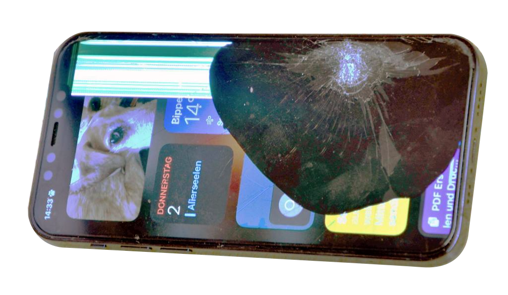

# wake-up

### a pretty simple, no-fuzz alarm clock

Just a simple attempt at creating a web-based alarm clock in order to replace my phone as I managed to wreck it by slamming the hood - again.

## Tools used:

- [GIMP](https://www.gimp.org/)
- [Audacity](https://www.audacityteam.org/)
- [VS Code](https://code.visualstudio.com/download)
- [Chrome DevTools](https://chromium.googlesource.com/chromium/src/+/main/docs/linux/build_instructions.md)

## Inspiration for this project:

- Hyster 8 to. forktruck
- a random Volvo
- a clumsy wanna-be mechanic

